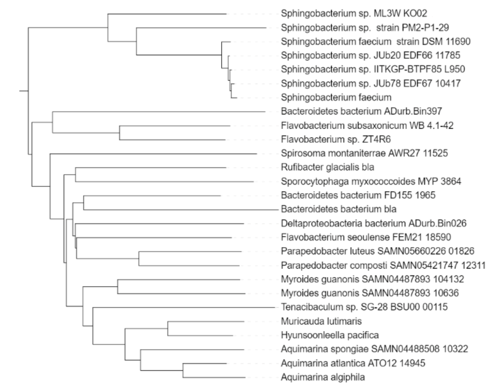

# EXERCISE 1: ANTIBIOTIC RESISTANCE GENES

Bacteria can become resistant to antibiotics with the help of antibiotic resistance genes (ARGs). Today, ARGs pose one of the major challenges to healthcare worldwide. They can be detected everywhere, from hospitals, to sewers, to deep in the ocean. One of the reasons that ARGs spread so quickly is that bacteria can acquire ARGs not just vertically (via descent from parent cells that had them), but also horizontally (within the same generation, without reproduction). This process is called Horizontal Gene Transfer (HGT).

<ol type="a">
  <li>
    Given the alignment of an ARG below (assume that the 1st position in this alignment is also the 1st position in the codon):
  <ol type="i">
    <li>Where are the informative sites for parsimony method?</li>
    <li>Draw a phylogenetic tree using maximum parsimony.</li>
    <li>Do synonymous substitutions occur more often than non-synonymous substitutions? Hint, use a codon table such as the one at <a href="https://en.wikipedia.org/wiki/DNA_and_RNA_codon_tables">https://en.wikipedia.org/wiki/DNA_and_RNA_codon_tables</a>. What does this mean for selective pressure?</li>
    <li>Do transversions occur more often than transitions in this alignment?</li>
  </ol>
  </li>
</ol>

<table>
  <tr>
    <td>Muricauda_lutimaris</td>
    <td>ATG TGT AAT GAG TGG TT<ins>A</ins> T<ins>T</ins>C AGA ATG AAA AT<ins>A</ins></td>
  </tr>
  <tr>
    <td>Muricauda_aquimarina</td>
    <td>ATG TGT <ins>G</ins>AT GAG TGG TT<ins>A</ins> TCC AGA ATG AAA AT<ins>A</ins></td>
  </tr>
  <tr>
    <td>Aquimarina_spongiae</td>
    <td>AT<ins>A</ins> TGT AAT GAG TGG TTT TCC AG<ins>G</ins> ATG AAA ATG</td>
  </tr>
  <tr>
    <td>Aquimarina_algiphila</td>
    <td>AT<ins>A</ins> TG<ins>G</ins> AAT GAG TGG <ins>C</ins>TT TCC AGA AT<ins>C</ins> AAA <ins>C</ins>TG</td>
  </tr>
  <tr>
    <td>Aquimarina_atlantica</td>
    <td>AT<ins>A</ins> TGT AAT GAG TGG TTT TCC AGA ATG AAA <ins>C</ins>TG</td>
  </tr>
</table>

<ol type="a" start="2">
  <li>Below you will find part of a phylogenetic gene tree containing Beta-lactamases, one of the protein families encoding Antibiotic Resistance.</li>
</ol>

<ol type="a" start="2">
  <ol type="i">
    <li>Was this tree constructed using UPGMA? How do you know?</li>
    <li>What do the different branch lengths mean?</li>
    <li>You probably don't know most of the bacteria in this tree. Can you still see some evidence of related organisms grouping together? Where?</li>
    <li>All taxa in this tree are members of the Bacteroidetes phylum, except for the one bacterium belonging to the Deltaproteobacteria. How can you interpret this in view of the tree above?</li>
  </ol>
</ol>

[Go to exercise 2](02-Exercise.md)
