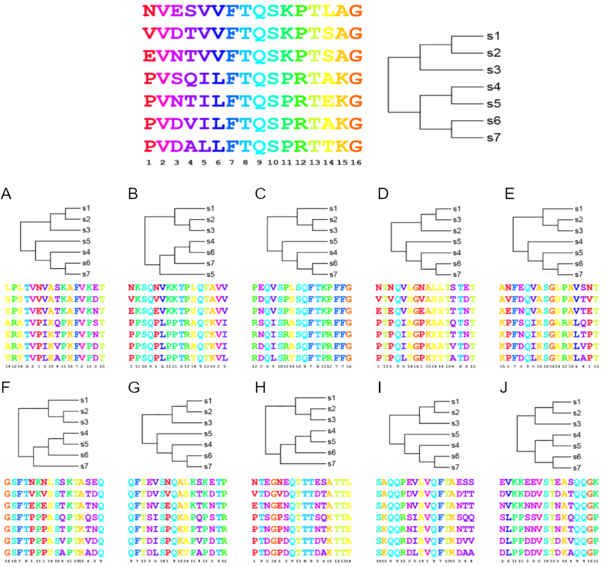
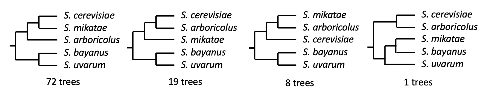

# EXERCISE 3 – THE EVOLUTIONARY HISTORY OF YEAST

*Saccharomyces* is a genus of fungi that has been cultivated extensively by humans. They are used in fermentations, such as in pastry and bread dough, as well as in alcohol production, such as beer. Its most prominent species, *Saccharomyces cerevisiae*, is one of the most well-researched organisms on the planet. As such, this genus has been thoroughly studied, and genomic data exist for many of its species.

Here, we will evaluate the phylogeny of yeast species using a 18S rRNA phylogeny, and using bootstrap pseudoreplicates as a methodology to assess the robustness of the results.

**Bootstrap pseudoreplicates.** To illustrate how this method works, find below a multiple sequence alignment (MSA) consisting of protein sequences from 7 species with a length of 16 amino acids. Next to it, the phylogenetic tree made from this alignment. Below, ten reshuffled versions (bootstrap pseudoreplicates) of the MSA, and the corresponding trees.



These trees indicate that some groupings are more robust than others. For instance, all trees agree that clades (s1,s2,s3) and (s4,s5,s6,s7) are separate. But topologies within these clades are less clear. For example, 5 trees indicate that s2 and s3 cluster together, 4 that s1 and s2 cluster together, and 1 that s1 and s3 cluster together.

<ol type="a">
  <li>
    A group of researchers used a protein sequence from five *Saccharomyces* species to perform a phylogenetic analysis, including a bootstrap analysis such as the one above. Find below the different topologies that were obtained. Draw the most likely tree with bootstrap values based on these results.
  </li>
</ol>



<ol type="a" start="2">
  <li>
    Let’s now perform a phylogenetic reconstruction of 18S rRNA sequences. First, take a look at the alignment. How many sequences are there? How many positions? Is there any sequence with less information than the rest? How conserved is the alignment?
  </li>
  <li>
    Now, let’s reconstruct a tree. To do this, use the software IQTree. Download the Linux (or Mac) version of the software from <a href="http://www.iqtree.org/#download">http://www.iqtree.org/#download</a>. After decompressing, you should be able to run the software directly, or you may need to change the ‘mode’ of this file so your computer recognises it as an executable (use the command “<strong>chmod u+x $FILE</strong>” by replacing “$FILE” with the name of the executable file within the bin folder. Now you can reconstruct your own tree. We will use the following command (replace “$ALIGNMENT” with your alignment file):

  </li>
</ol>

```
iqtree -s $ALIGNMENT -m GTR+G -b 100 -wbt -pre yeast
```

This reconstruction will use the evolutionary model “GTR+G”, run 100 bootstrap pseudorreplicates, which it will write to a file (-wbt = write bootstrap), and generate files with the prefix “yeast”.

<ol type="i">
  <li>
    Why are we using the evolutionary model “GTR+G”?
  </li>
  <li>Look at the iqtree file (“yeast.iqtree”). What information can you extract from the “Sequence alignment” section?</li>
  <li>Now look at the tree in the “Maximum likelihood tree” section. First, is this tree rooted or unrooted?</li>
  <li>How does this tree compare with the consensus tree obtained above? Are the trees compatible?</li>
  <li>Assuming that the root in your trees lie in the same location as in the tree above (between the group formed by <em>S. bayanus</em> and <em>S. uvarum</em>, and everything else), and based on bootstrap values, how often do <em>S. cerevisiae</em>, <em>S. cariocanus</em> and <em>S. paradoxus</em> form a monophyletic group?</li>
  <li>How many bootstrap trees contain the monophyletic group formed by these three species, but with a different topology for this clade? What are the possible alternative topologies?</li>
</ol>
